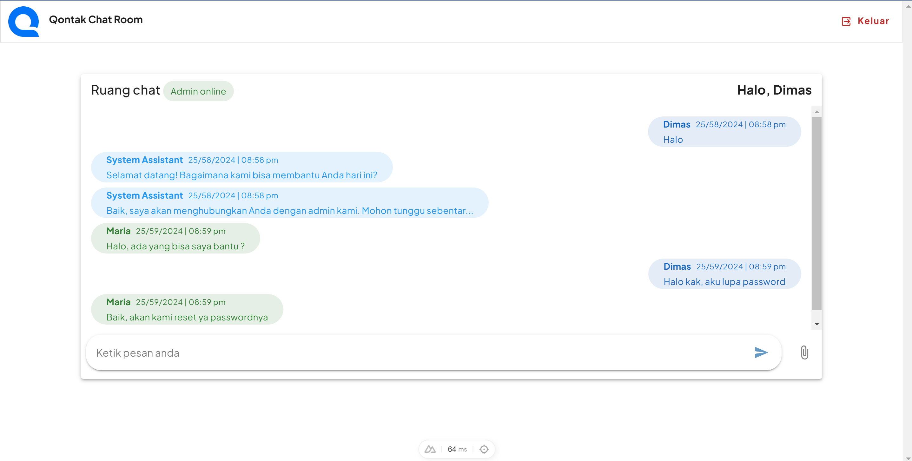
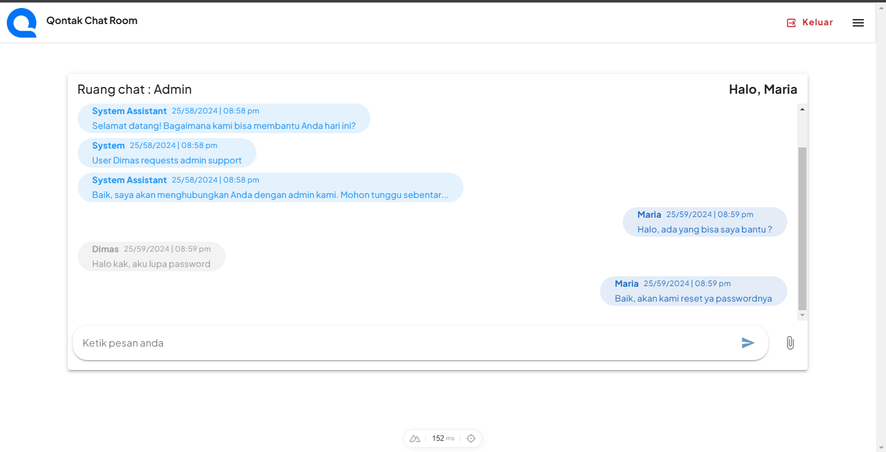

# Technical Test : Tri

Technical test for : Qontak

## Features

- Responsive
- Realtime Socket
- Cross platform

## Tech Stack

**Client:** NuxtJS, VueJS, Vuetify

**Server:** Nitro,External API, Socket

## Run Locally

Clone the project

```bash
  git clone <gitlab https>
```

Go to the project directory

```bash
  cd qontak-technical-test
```

Install dependencies

```bash
  npm install
```

## Route Tests

Route tests based on roles, to authenticate as user :

```bash
 /auth/login
```

to authenticate as admin :

```bash
 /auth/admin
```

## Run Application

Start the server

```bash
  npm run dev
```

## Preview

General user


Admin user

